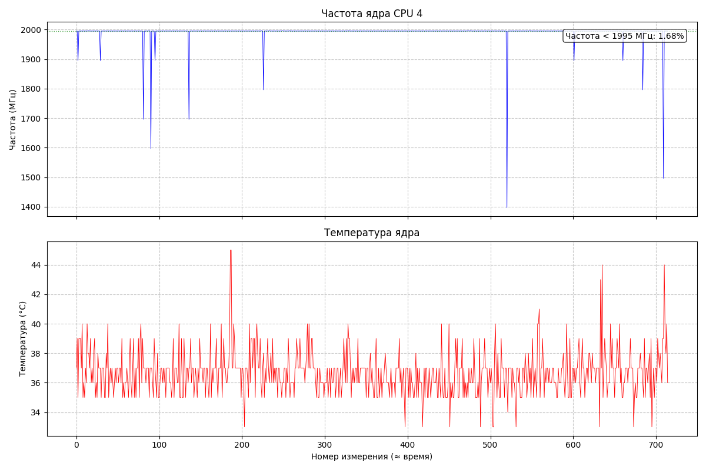
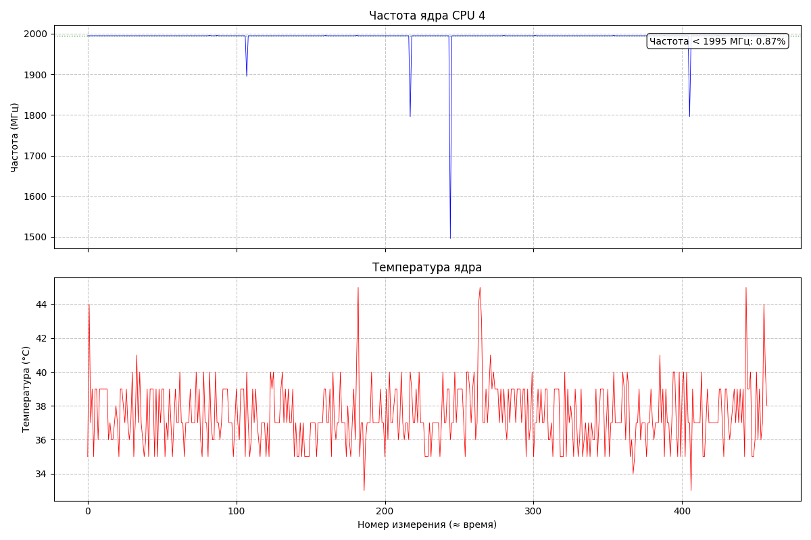
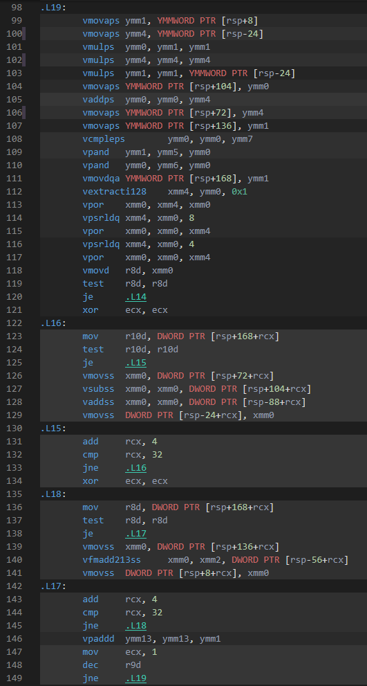
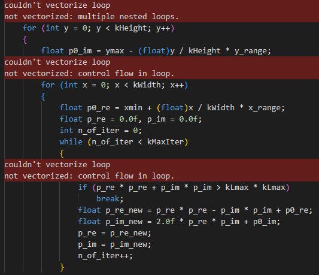
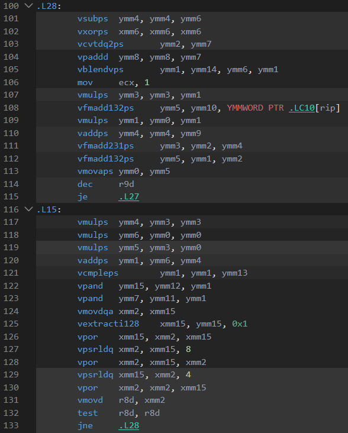
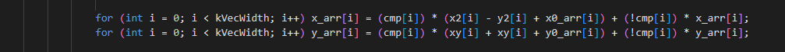
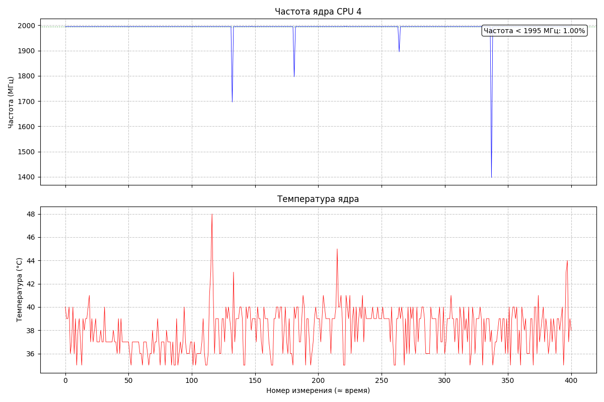
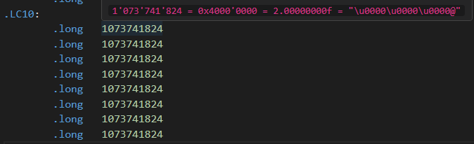
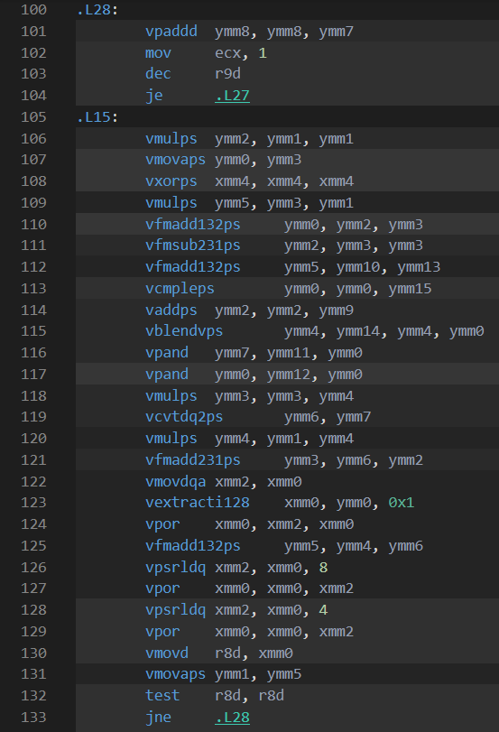
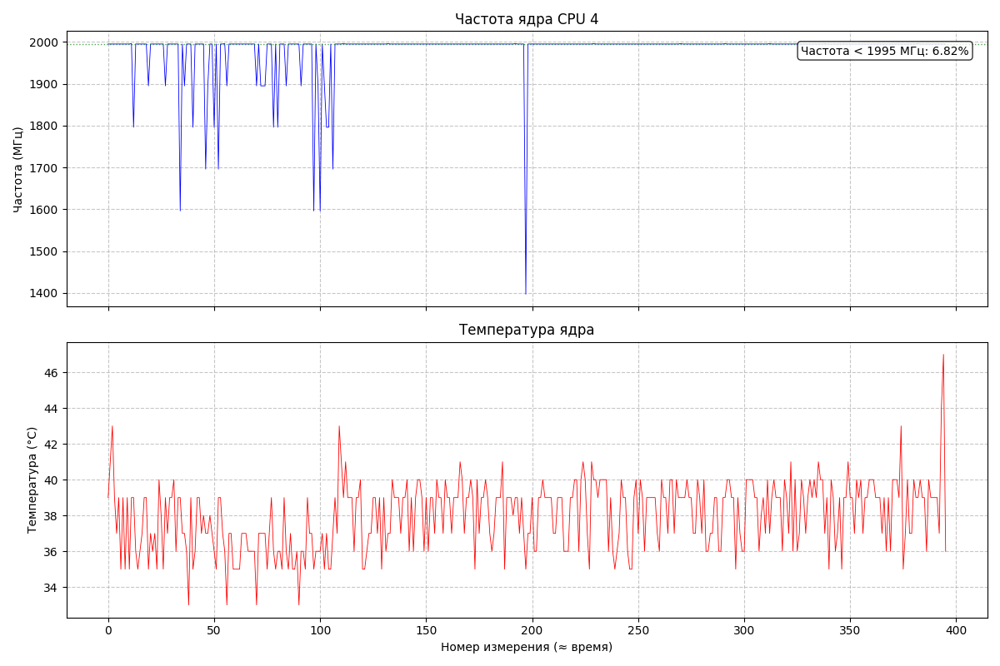

# Лабораторная работа на тему "Ускорение работы программы путем использования SIMD (Single Instruction Multiple Data) (векторизации)"
## Цели и задачи:
### 1. Написать простую программу с большим объёмом расчётов.
### 2. Исследовать зависимость количества тактов, требуемого для вычислений, от выбранного способа оптимизации.
### - 2.1 Подумать над векторизацией этой программы, попробовать сделать это путём работы с массивами.
### - 2.2 Изучить Intel Intrinsics[1] и применить их для оптимизации.
### 3. Исследовать зависимость количества тактов, требуемого для вычислений, от флагов оптимизации компилятора.

### В качестве программы с большим объёмом расчётов было предложено вычисление и отрисовка множества Мандельброта.

### Реализации
1. **`Simple`** - "наивная", линейная реализация кода, которая работает с каждой точкой плоскости по-отдельности.
2. **`Quad`** - реализация кода с векторизацией "вручную".
3. **`Vector`** - реализация кода с векторизацией при помощи Intel Intrinsics[1];

### Параметры системы, на которой производились вычисления
| Параметр | Значение |
|----------|----------|
| Система  | Windows 11|
| CPU      | 12th Gen Intel Core i5-12450H, 16ГБ ОЗУ|
| Опции компилятора | -march=native -g -fno-omit-frame-pointer **-O2 или -O3** -DNDEBUG |
| Компилятор | g++ 13.2.0|
| Средняя температура CPU | < 48 °C |
| Средняя частота CPU | 1995 MGHZ|

## Ход работы
Когда три реализации уже написаны и проверены на корректность путем визуализации комплексной плоскости, можно приступать к проведению замеров.
Для корректного проведения замеров необходимо обеспечить одинаковые условия для работы каждой программы. Для этого нужно подумать о следующих факторах, которые могут сказаться на измерениях:
* Тротлинг
* Распределение задач по ядрам
* Питание ноутбука
* Окружающая среда

Во избежание тротлинга и для стабилизации тактовой частоты процессора я отключил режимы Turbo Boost при помощи приложения Intel XTU и следил за показателями температуры и тактовой частоты при помощи AIDA64 и строил графики на основе отчётов, предоставляемых этой программой. Иногда всё же происходили проседания тактовой частоты процессора, но таких точек сильно меньше, чем точек с ожидаемой тактовой частотой. Чтобы измерения не зависели от того, как ОС распределит задачи по ядрам, я зафиксировал расчёты на ядре CPU4 (если нумеровать с единицы). Чтобы обеспечить одинаковые условия питания ноутбука, я не отключал его от зарядки (то есть все измерения производились на ноутбуке, работающем от сети, а не от батареи). Для обеспечения одинаковых условий окружающей среды, я проводил все измерения в одной комнате. Пренебрегаем изменением температуры окружающей среды в течение эксперимента.

Полученные измерения обрабатываем следующим образом: из 10 полученных значений отбрасываем минимальное и максимальное, а от оставшихся 8 значений берём среднее арифметическое.

<div style="font-size: 1.2em; overflow-x: auto;">
  <table border="1" cellpadding="8" cellspacing="0" style="border-collapse: collapse; width: 100%;">
    <thead>
      <tr>
        <th style="text-align: center;">Реализация</th>
        <th style="text-align: center;">Среднее арифметическое после отбрасывания min и max (в тиках) </th>
        <th style="text-align: center;">Мониторинг параметров системы</th>
      </tr>
    </thead>
    <tbody>
      <tr>
        <td style="text-align: center;">Simple с O2</td>
        <td style="text-align: center;">(7,7289 ± 0,0011)·10¹⁰</td>
        <td rowspan="4" style="text-align: left; vertical-align: top;">
          
        </td>
      </tr>
      <tr>
        <td style="text-align: center;">Simple с O3</td>
        <td style="text-align: center;">(7,8279 ± 0,0003)·10¹⁰</td>
      </tr>
      <tr>
        <td style="text-align: center;">Vector с O2</td>
        <td style="text-align: center;">(2,1363 ± 0,0002)·10¹⁰</td>
      </tr>
      <tr>
        <td style="text-align: center;">Vector с O3</td>
        <td style="text-align: center;">(2,1502 ± 0,0002)·10¹⁰</td>
      </tr>
      <tr>
        <td style="text-align: center;">Quad с O2</td>
        <td style="text-align: center;">(7,2736 ± 0,0006)·10¹⁰</td>
        <td rowspan="2" style="text-align: left; vertical-align: top;">
          
        </td>
      </tr>
      <tr>
        <td style="text-align: center;">Quad с O3</td>
        <td style="text-align: center;">(5,3175 ± 0,0004)·10¹⁰</td>
        <td style="text-align: center;"></td>
      </tr>
    </tbody>
  </table>
</div>

Сравним полученные отношения для каждой реализации.
<div style="display: flex; gap: 20px; justify-content: center;">
    <div style="flex: 1;">
        <div style="font-size: 1.2em; overflow-x: auto;">
          <table border="1" cellpadding="8" cellspacing="0" style="border-collapse: collapse; width: 90%;">
            <thead>
              <tr>
                <th style="text-align: center;">Реализация</th>
                <th style="text-align: center;">Значение O3/O2</th>
              </tr>
            </thead>
            <tbody>
              <tr>
                <td style="text-align: center;">Simple</td>
                <td style="text-align: center;">1,0128</td>
              </tr>
              <tr>
                <td style="text-align: center;">Quad</td>
                <td style="text-align: center;">0,7311</td>
              </tr>
              <tr>
                <td style="text-align: center;">Vector</td>
                <td style="text-align: center;">1,0030</td>
              </tr>
            </tbody>
          </table>
        </div>
    </div>
    <div style="flex: 1;">
        <div style="font-size: 1.2em; overflow-x: auto;">
          <table border="1" cellpadding="8" cellspacing="0" style="border-collapse: collapse; width: 90%;">
            <thead>
              <tr>
                <th style="text-align: center;">Отношение реализаций с O2</th>
                <th style="text-align: center;">Значение отношения</th>
              </tr>
            </thead>
            <tbody>
              <tr>
                <td style="text-align: center;">Simple/Quad</td>
                <td style="text-align: center; color: red">1,0626</td>
              </tr>
              <tr>
                <td style="text-align: center;">Simple/Vector</td>
                <td style="text-align: center;">3,6052</td>
              </tr>
            </tbody>
          </table>
        </div>
    </div>
</div>

Обратим внимание на значение Simple/Quad (подсвечено красным). Это отношение близко к единице, то есть получилось, что Quad-версия практически не ускорила программу, что очень странно.<br>
Чтобы разобраться с тем, почему Quad версия такая медленная, я зашёл на godbolt.org, чтобы посмотреть, в какие ассемблерные инструкции компилятор переводит код моей функции.
Назовём следующий код `горячим местом`, потому что именно там сосредоточены все расчёты:
```
for (int y = 0; y < kHeight; y++)  // Проверка каждой точки плоскости на принадлежность множеству
    {
        float y0 = ymax - (float)y / kHeight * y_range;
        for (int x = 0; x < kWidth; x += kVecWidth)
        {
            float x0 = xmin + (float)x / kWidth * x_range;
            float x0_arr[kVecWidth] = {};
            for (int i = 0; i < kVecWidth; i++) x0_arr[i] = x0 + i * dx;

            float y0_arr[kVecWidth] = {};
            for (int i = 0; i < kVecWidth; i++) y0_arr[i] = y0;

            float x_arr[kVecWidth] = {}; for (int i = 0; i < kVecWidth; i++) x_arr[i] = x0_arr[i];
            float y_arr[kVecWidth] = {}; for (int i = 0; i < kVecWidth; i++) y_arr[i] = y0_arr[i];

            int n_of_iters[kVecWidth] = {};
            for (int n = 0; n < kMaxIter; n++)
            {
                float x2[kVecWidth] = {}; for (int i = 0; i < kVecWidth; i++) x2[i] = x_arr[i] * x_arr[i];
                float y2[kVecWidth] = {}; for (int i = 0; i < kVecWidth; i++) y2[i] = y_arr[i] * y_arr[i];
                float xy[kVecWidth] = {}; for (int i = 0; i < kVecWidth; i++) xy[i] = x_arr[i] * y_arr[i];
                float r2[kVecWidth] = {}; for (int i = 0; i < kVecWidth; i++) r2[i] = x2[i] + y2[i];

                int cmp[kVecWidth] = {0};
                for (int i = 0; i < kVecWidth; i++)
                    if (r2[i] <= kLmax * kLmax)
                        cmp[i] = 1;
                    else
                        cmp[i] = 0;

                int mask = 0;
                for (int i = 0; i < kVecWidth; i++) mask |= cmp[i] << i;
                if (!mask) break;

                for (int i = 0; i < kVecWidth; i++) if (cmp[i]) x_arr[i] = x2[i] - y2[i] + x0_arr[i]; else x_arr[i] = x_arr[i];
                for (int i = 0; i < kVecWidth; i++) if (cmp[i]) y_arr[i] = xy[i] + xy[i] + y0_arr[i]; else y_arr[i] = y_arr[i];

                for (int i = 0; i < kVecWidth; i++) n_of_iters[i] += cmp[i];
            }
            for (int i = 0; i < kVecWidth; ++i)
            {
#ifdef _GRAPHICS_MODE
                video_buf[y * kWidth + (x + i)] = GetColor(n_of_iters[i]);
#else
                local += n_of_iters[i];
#endif
            }
        }
    }
```

Посмотрим, во что g++ превращает этот код:



Мы видим в коде много ветвлений и обращений в память, что говорит о том, что компилятору не удалось векторизовать вычисления. Взглянем на Opt Remarks и увидим, что компилятор не может векторизовать код вида "for if".



Для решения этой проблему используем хитрый ход: **заменим ветвление на арифметику, дающую тот же результат**. Сделаем это следующим образом:
```
for (int i = 0; i < kVecWidth; i++) if (cmp[i]) x_arr[i] = x2[i] - y2[i] + x0_arr[i]; else x_arr[i] = x_arr[i];
for (int i = 0; i < kVecWidth; i++) if (cmp[i]) y_arr[i] = xy[i] + xy[i] + y0_arr[i]; else y_arr[i] = y_arr[i];
```
Заменим на
```
for (int i = 0; i < kVecWidth; i++) x_arr[i] = (cmp[i]) * (x2[i] - y2[i] + x0_arr[i]) + (!cmp[i]) * x_arr[i];
for (int i = 0; i < kVecWidth; i++) y_arr[i] = (cmp[i]) * (xy[i] + xy[i] + y0_arr[i]) + (!cmp[i]) * y_arr[i];
```



Видим явные изменения в ассемблерном коде. Сократилось количество обращений в память и компилятор уже не пишет, что не смог векторизовать вычисления.



Произведем замеры новой версии Quad-реализации.

<div style="font-size: 1.2em; overflow-x: auto;">
  <table border="1" cellpadding="8" cellspacing="0" style="border-collapse: collapse; width: 100%;">
    <thead>
      <tr>
        <th style="text-align: center;">Файл</th>
        <th style="text-align: center;">Среднее арифметическое после отбрасывания min и max (в тиках)</th>
        <th style="text-align: center;">Мониторинг параметров системы</th>
      </tr>
    </thead>
    <tbody>
      <tr>
        <td style="text-align: center;">New_Quad с O2</td>
        <td style="text-align: center;">(3,087 ± 0,014)·10¹⁰</td>
        <td rowspan="2" style="text-align: left; vertical-align: top;">
          
        </td>
      </tr>
      <tr>
        <td style="text-align: center;">New_Quad с O3</td>
        <td style="text-align: center;">(7,8679 ± 0,0013)·10¹⁰</td>
      </tr>
    </tbody>
  </table>
</div>

<div style="font-size: 1.2em; overflow-x: auto;">
  <table border="1" cellpadding="8" cellspacing="0" style="border-collapse: collapse; width: 100%;">
    <thead>
      <tr>
        <th style="text-align: center;">Отношение версий</th>
        <th style="text-align: center;">Было/Стало</th>
      </tr>
    </thead>
    <tbody>
      <tr>
        <td style="text-align: center;">Quad с O2/New_Quad с O2</td>
        <td style="text-align: center; color : lightgreen">2,3561</td>
      </tr>
      <tr>
        <td style="text-align: center;">Quad с O3/New_Quad с O3</td>
        <td style="text-align: center; color : lightcoral">0,6758</td>
      </tr>
      </tr>
    </tbody>
  </table>
</div>

Видим очень интересный результат: время работы реализации Quad с O2 уменьшилось более, чем в 2 раза, а время работы реалзиации Quad с O3 увеличилось примерно в 1,5 раза. К сожалению, понять, почему это происходит, у меня не получилось, потому что с O3 компилятор меняет код до неузнаваемости.
Но продолжим работу с O2. Изучая ассемблерный код после хитрого хода, мы можем заметить, что осталось еще одно обращение в память:
```
vfmadd132ps ymm5, ymm10, YMMWORD PTR .LC10[rip]
```

Если мы посмотрим, что лежит по метке .LC10[rip], то увидим там 8 значений, равных 2.0



Есть предположение, что компилятор сделал следующую цепочку преобразований:
| Этап | Представление | Проблема |
|------|---------------|-----------|
| Исходный код | `xy + xy + y0` | – |
| После упрощения | `2 * xy + y0` | – |
| После раскрытия FMA | `fma(2.0, xy, y0)` | Не хватило регистров для константы `2.0` , поэтому положил его в память|

Чтобы решить эту проблему, нужно произвести следующую перестановку кода:
```
                int mask = 0;
                for (int i = 0; i < kVecWidth; i++) mask |= cmp[i] << i;
                if (!mask) break;

                for (int i = 0; i < kVecWidth; i++) x_arr[i] = (cmp[i]) * (x2[i] - y2[i] + x0_arr[i]) + (!cmp[i]) * x_arr[i];
                for (int i = 0; i < kVecWidth; i++) y_arr[i] = (cmp[i]) * (xy[i] + xy[i] + y0_arr[i]) + (!cmp[i]) * y_arr[i];
```
меняем на

```
                for (int i = 0; i < kVecWidth; i++) x_arr[i] = (cmp[i]) * (x2[i] - y2[i] + x0_arr[i]) + (!cmp[i]) * x_arr[i];
                for (int i = 0; i < kVecWidth; i++) y_arr[i] = (cmp[i]) * (xy[i] + xy[i] + y0_arr[i]) + (!cmp[i]) * y_arr[i];

                int mask = 0;
                for (int i = 0; i < kVecWidth; i++) mask |= cmp[i] << i;
                if (!mask) break;
```

Посмотрим на ассемблерный код новой версии Fixed_Quad реализации Quad:



Видим векторизованный код без обращений память, значит, теперь компилятору хватило регистров. Это нас устраивает. Произведём измерения Fixed_Quad.

<div style="font-size: 1.2em; overflow-x: auto;">
  <table border="1" cellpadding="8" cellspacing="0" style="border-collapse: collapse; width: 100%;">
    <thead>
      <tr>
        <th style="text-align: center;">Файл</th>
        <th style="text-align: center;">Среднее арифметическое (после отбрасывания min/max)</th>
        <th style="text-align: center;">Мониторинг параметров системы</th>
      </tr>
    </thead>
    <tbody>
      <tr>
        <td style="text-align: center;">Fixed_Quad с O2</td>
        <td style="text-align: center;">30052992085</td>
        <td rowspan="2" style="text-align: left; vertical-align: top;">
          
        </td>
      </tr>
      <tr>
        <td style="text-align: center;">Fixed_Quad с O3</td>
        <td style="text-align: center;">79288027603</td>
      </tr>
    </tbody>
  </table>
</div>

<div style="font-size: 1.2em; overflow-x: auto;">
  <table border="1" cellpadding="8" cellspacing="0" style="border-collapse: collapse; width: 100%;">
    <thead>
      <tr>
        <th style="text-align: center;">Отношение версий</th>
        <th style="text-align: center;">Было/Стало</th>
      </tr>
    </thead>
    <tbody>
      <tr>
        <td style="text-align: center;">New_Quad с O2/Fixed_Quad с O2</td>
        <td style="text-align: center;">1,0271</td>
      </tr>
      <tr>
        <td style="text-align: center;">New_Quad с O3/Fixed_Quad с O3</td>
        <td style="text-align: center;">0,9923</td>
      </tr>
      </tr>
    </tbody>
  </table>
</div>

Видим, что для O2 это изменение дало еще незначительное ускорение работы программы.
Для О3 получилось, что программа стала работать дольше, но мы не можем это явно утверждать, потому что это могло произойти из-за погрешностей измерений.
Также стоит отметить, что именно на Fixed_Quad с O2 происходят необъяснимые нестабильности с тактовой частотой процессора. К сожалению, пока не могу объяснить причину этого.

Сравним итоговые отношения для каждой реализации.
<div style="display: flex; gap: 20px; justify-content: center;">
    <div style="flex: 1;">
        <div style="font-size: 1.2em; overflow-x: auto;">
          <table border="1" cellpadding="8" cellspacing="0" style="border-collapse: collapse; width: 90%;">
            <thead>
              <tr>
                <th style="text-align: center;">Файл</th>
                <th style="text-align: center;">Значение O3/O2</th>
              </tr>
            </thead>
            <tbody>
              <tr>
                <td style="text-align: center;">Simple</td>
                <td style="text-align: center;">1,0128</td>
              </tr>
              <tr>
                <td style="text-align: center;">Quad</td>
                <td style="text-align: center; color: lightcoral">2,6382</td>
              </tr>
              <tr>
                <td style="text-align: center;">Vector</td>
                <td style="text-align: center;">1,0030</td>
              </tr>
            </tbody>
          </table>
        </div>
    </div>
    <div style="flex: 1;">
        <div style="font-size: 1.2em; overflow-x: auto;">
          <table border="1" cellpadding="8" cellspacing="0" style="border-collapse: collapse; width: 90%;">
            <thead>
              <tr>
                <th style="text-align: center;">Отношение реализаций с O2</th>
                <th style="text-align: center;">Значение отношения</th>
              </tr>
            </thead>
            <tbody>
              <tr>
                <td style="text-align: center;">Simple/Quad</td>
                <td style="text-align: center; color: lightgreen">2,5718</td>
              </tr>
              <tr>
                <td style="text-align: center;">Simple/Vector</td>
                <td style="text-align: center;">3,6052</td>
              </tr>
            </tbody>
          </table>
        </div>
    </div>
</div>

Теперь таблица Отношений реализаций с О2 выглядит логичнее. Реализация Quad ускоряет работу программы, но не так сильно, как реализация Vector. Однако остаётся вопрос, почему это ускорение так далеко от теоретически возможного, которое равно 8. Также остается вопрос, почему версия Quad с O3 сильно медленнее, чем Quad c O2 и даже медленнее, чем реализация Simple.

## Вывод
В ходе этой лабораторной работы я научился использовать векторные (SIMD) инструкции для оптимизации программы. Также я понял, насколько важно уметь разбираться в ассемблерном коде, сгенерированном компилятором, ведь только понимая ассемблер мы можем делать выводы о выбранных решениях компилятора и исправлять и, таким образом, я получил важный опыт работы с godbolt.org. Ещё одной важной частью работы было проведение корректных измерений, для этого я научился работать с AIDA64 и Intel XTU, таким образом, получше узнал возможности настройки своего ноутбука.

## Интересные факты
Когда запускаем тест С ГРАФИКОЙ на ФИКСИРОВАННОМ ядре, отрисовка кадра происходит очень медленно, потому что два потока борются за ядро (расчет и отрисовка).
Когда запускаем тест с ГРАФИКОЙ без фиксированного ядра, планировщик распределяет один поток на одно ядро, а другой на другое и получается гораздо быстрее, чем первый вариант.

Когда запускаем тест БЕЗ ГРАФИКИ на ФИКСИРОВАННОМ ядре, всё хорошо считается.
Когда запускаем тест БЕЗ ГРАФИКИ БЕЗ ФИКСИРОВАННОГО ядра, он работает дольше, потому что когда планировщик перемещает процесс с одного ядра на другое, происходит инвалидация кэшей.


## Использованная литература
1. [Intel® Intrinsics Guide](https://www.intel.com/content/www/us/en/docs/intrinsics-guide/index.html)
